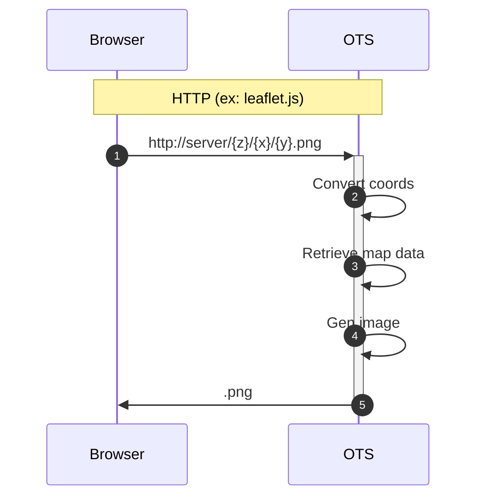
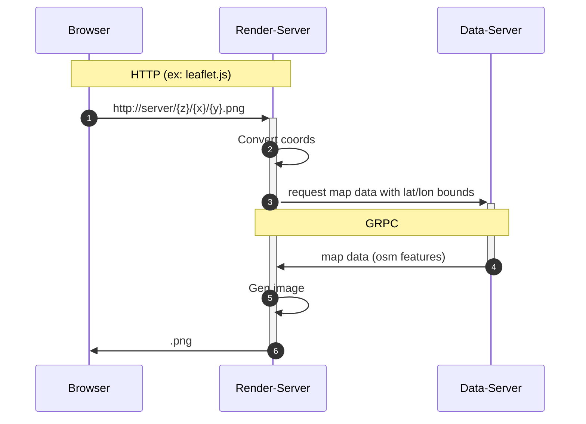

# OpenStreetMap Tile Server (OTS)
OTS는 서버로 시작하면서 OpenStreetMap의 데이터파일(*.osm.pbf)을 메모리로 읽어들인 후
HTTP 요청에 따라 지도를 생성할 수 있는 타일 서버이다.


### 타일 렌더링 서버와 OSM 데이터 서버를 하나의 프로세스로 구동하는 방법

```
./tmp/ots server -p 1918 -i ./tmp/my-area.osm.pbf 
```



### 렌더링 서버와 데이터 서버를 별도의 프로세스로 구동하는 방법

- 먼저 데이터 서버를 위의 예와 동일한 방법으로 구동한 후

```
./tmp/ots server -p 1918 -i ./tmp/my-area.osm.pbf 
```

- 렌더링 서버가 데이터 서버를 바라보도록 `-i` 파라미터에 데이터 서버의 endpoint를 지정한다.
```
./tmp/ots server -p 1919 -i tcp://127.0.0.1:1918
```

이렇게 한 후 레더링 서버를 웹브라우저로 접속하면 아래와 같은 흐름으로 처리된다.


`웹브라우저` --> `127.0.0.1:1919` (rendering server) --> `127.0.0.1:1918` (data server)




### 서버 설정 파일로 구동하는 방법

`server-config-sample.hcl`을 수정하여 설정파일을 생성하고 `*.hcl` 확장자로 저장하고, `-c` 옵션으로 경로를 지정한다.

```
./tmp/ots server -c <config_file.hcl>
```

*공통 설정 항목*

| 항목          | 설명         | 예   | 비고|
| -------------| ------------| --- | -------- |
| `pname`      | 프로세스의 이름을 설정 | `"ots01"` | |
| `osm-data-source` | 데이터 파일 또는 서버의 경로 | `"./tmp/south-korea-2022-04-18.osm.pbf"` `"tcp://127.0.0.1:1918"` |  |
| `bind`       | listening address | `"127.0.0.1"` | |
| `port`       | listening port    | 1919 | |
| `grpc.max-recv-msg-size` | grpc 수신 메시지 제한 (MB) | 100 | |
| `grpc.max-send-msg-size` | grpc 송신 메시지 제한 (MB) | 100 | |
| `log.console`       | 로그 화면 출력       | `true` 또는 `false` | |
| `log.filename`      | 로그 파일 경로       |     | |
| `log.default-prefix-width` |            | 10 | |
| `log.default-level` | 로그 레벨           | `"TRACE"`| | 
| `http.console-color`| http 메시지 컬러 사용 | `true` 또는 `false` | |
| `http.debug-mode`   | http 서버 디버그 모드 | `true` 또는 `false` | |
| `httplog.console`   |||
| `httplog.filename`  |||
| `httplog.default-prefix-width`|||
| `httplog.default-level`|||

*렌더링 서버 설정 항목*

| 항목          | 설명         | 예   | 비고|
| -------------| ------------| --- | -------- |
| `cache-size` | lru cache의 크기 | 2000 | |
| `show-watermark` | 렌더링된 타일 이미지에 watermark삽입 | true 또는 false | 렌더서버 |
| `show-labels` | 렌더링중에 건물/도로명을 표시 | true 또는 false | 렌더서버 |


### *.osm.pdf 파일 획득 방법

한국 지역 osm.pbf 파일 다운로드
- https://download.geofabrik.de/asia/south-korea.html
- OSM data up to 2022-04-17T20:21:54Z. File size: 148 MB;

- https://wiki.openstreetmap.org/wiki/Planet.osm#Country_and_area_extracts

### osm.pbf 파일에 대한 설명은 다음을 참조

- https://wiki.openstreetmap.org/wiki/Elements
- https://wiki.openstreetmap.org/wiki/PBF_Format

- Nodes     : https://wiki.openstreetmap.org/wiki/Node
- Ways      : https://wiki.openstreetmap.org/wiki/Way
- Relations : https://wiki.openstreetmap.org/wiki/Relation