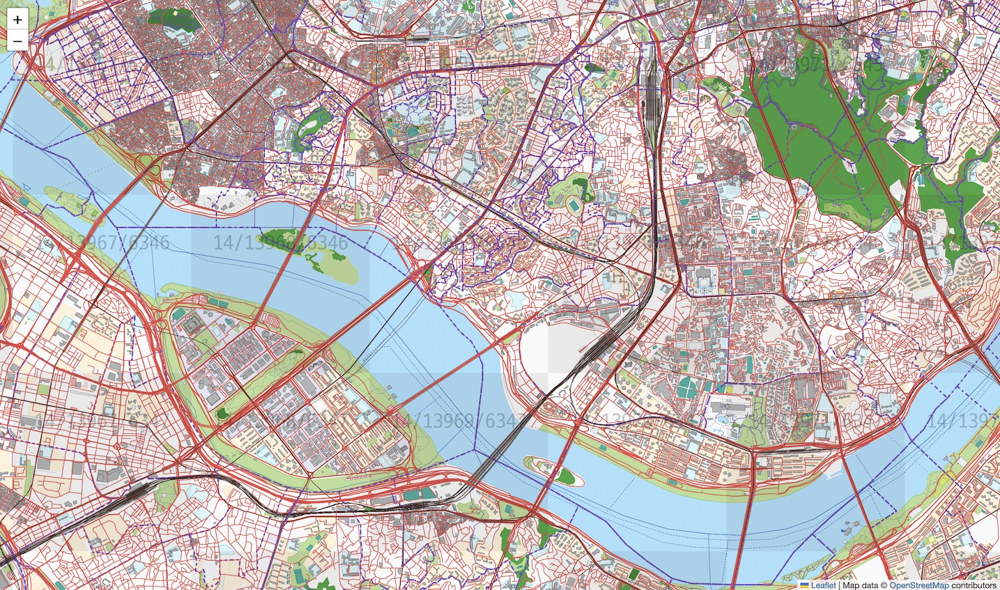
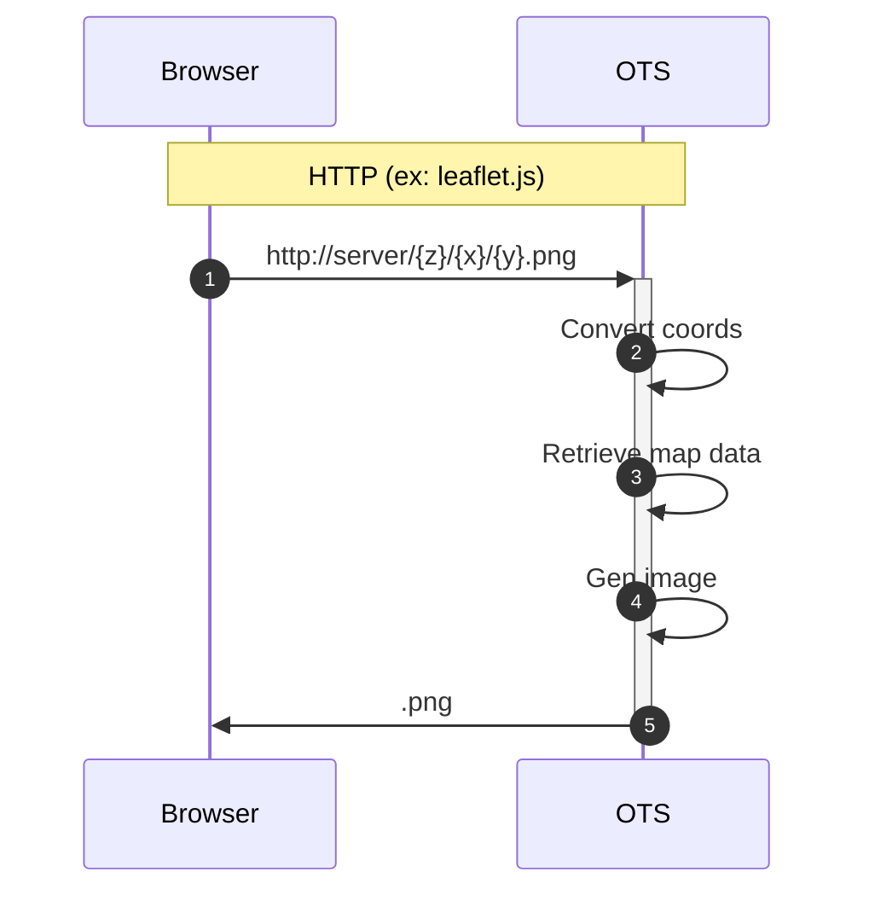
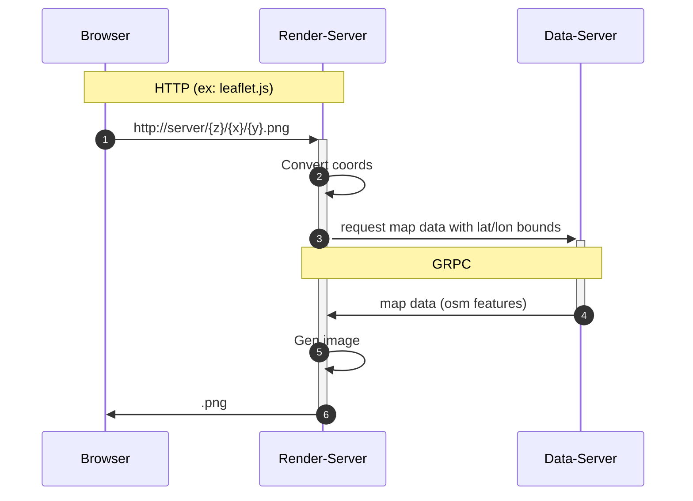

# OpenStreetMap Tile Server (OTS)

OTS is a server that loads OpenStreetMap data file (`*.osm.pbf`) into memory then generates map tiles for HTTP requests.



## Compile & Packaging

- checkout source codes
```sh
$ git clone https://github.com/OutOfBedlam/ots.git

$ cd ots
```

- compiled executable binary will be created in './tmp'

```sh
$ make
```

- create package as `./packages/ots-{version}-{os}-{arch}.zip`

```sh
$ make package
```

### Start OTS as tile-rendering-server and OSM data-server in a process

```
./tmp/ots server -p 1918 -i ./tmp/my-area.osm.pbf 
```



### Start tile-rendering-server and data-server

- start a process as a data-server

```
./tmp/ots server -p 1918 -i ./tmp/my-area.osm.pbf 
```

- start tile-rendering-server

> Specify the endpoint of data-server instead of `*.osm.pbf` file with `-i`

```
./tmp/ots server -p 1919 -i tcp://127.0.0.1:1918
```

- then web browser can retrieve map tiles as following flow

`Web browser` --> `127.0.0.1:1919` (rendering server) --> `127.0.0.1:1918` (data server)




### Configuration file

edit and copy `server-config-sample.hcl`, keep file extension as `*.hcl`. then apply the path with `-c` argument.

```
./tmp/ots server -c <config_file.hcl>
```

*config file items*

| item                     | desc                             | ex             |
| ------------------------ | -------------------------------- | -------------- |
| `pname`                  | process instance name            | `"ots01"`      |
| `osm-data-source`        | data file or data server address | `"./data.osm.pbf"`<br/> `"tcp://localhost:1918"` |
| `bind`                   | listening address                | `"127.0.0.1"`  |
| `port`                   | listening port                   | 1919           |
| `grpc.max-recv-msg-size` | grpc limit (MB)                  | 100            |
| `grpc.max-send-msg-size` | grpc limit (MB)                  | 100            |
| `log.console`            | log output to console            | `true` `false` |
| `log.filename`           | log file path                    |                |
| `log.default-prefix-width` |                                | 10             |
| `log.default-level`      | log level                        | `"TRACE"`      |
| `http.console-color`     | colored http log                 | `true` `false` |
| `http.debug-mode`        | debug http log                   | `true` `false` |
| `httplog.console`        |                                  |                |
| `httplog.filename`       |                                  |                |
| `httplog.default-prefix-width`|                             |                |
| `httplog.default-level`  |                                  |                |

*rendering server only items*

| item             | desc                                  | ex             |
| -----------------| --------------------------------------| -------------- |
| `cache-size`     | size of lru cache                     | 2000           |
| `show-watermark` | watermark (tile coordinates) on tiles | `true` `false` |
| `show-labels`    | enable labels                         | `true` `false` |

> All items in config file can be override by command line arguments. the name of argument is same as config item with double dash `--`. For example, to override port number `ots -c my-config.hcl --port=2929`, port number 2929 will be applied.


### Where to download `*.osm.pdf` files

ex) Download south korean osm.pbf file
- https://download.geofabrik.de/asia/south-korea.html
- OSM data up to 2022-04-17T20:21:54Z. File size: 148 MB;

- https://wiki.openstreetmap.org/wiki/Planet.osm#Country_and_area_extracts

### References about `osm.pbf` files

- https://wiki.openstreetmap.org/wiki/Elements
- https://wiki.openstreetmap.org/wiki/PBF_Format

- Nodes     : https://wiki.openstreetmap.org/wiki/Node
- Ways      : https://wiki.openstreetmap.org/wiki/Way
- Relations : https://wiki.openstreetmap.org/wiki/Relation