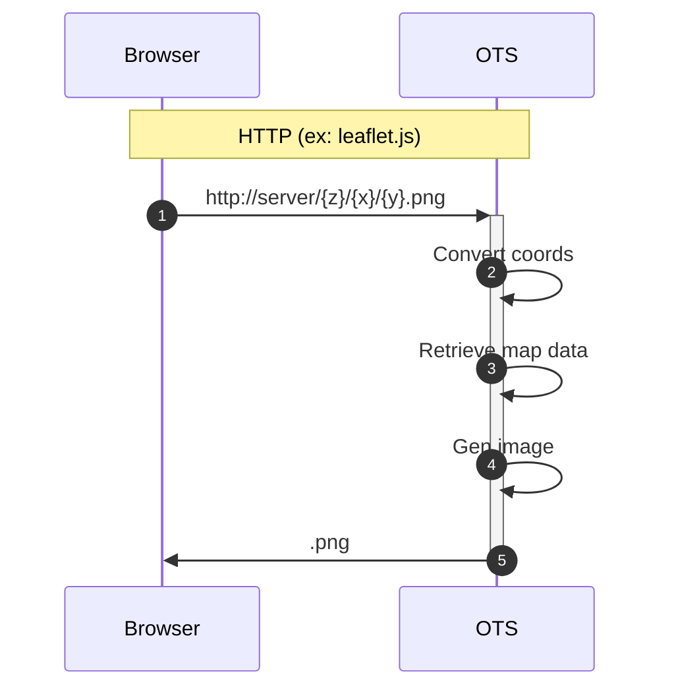
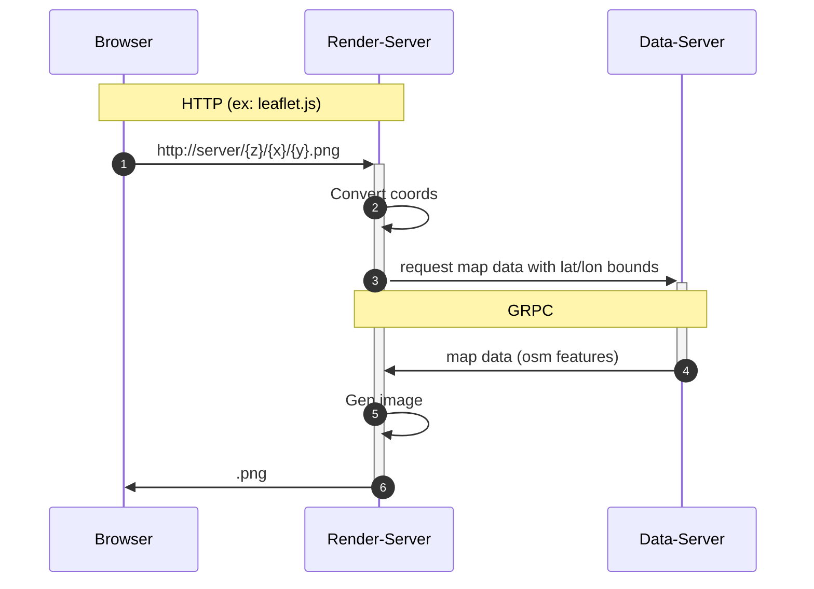

# OpenStreetMap Tile Server (OTS)

### 타일 렌더링 서버와 OSM 데이터 서버를 하나의 프로세스로 구동하는 방법

```
./tmp/ots server -p 1918 -i ./tmp/my-area.osm.pbf 
```



### 렌더링 서버와 데이터 서버를 별도의 프로세스로 구동하는 방법

- 먼저 데이터 서버를 위의 예와 동일한 방법으로 구동한 후

```
./tmp/ots server -p 1918 -i ./tmp/my-area.osm.pbf 
```

- 렌더링 서버가 데이터 서버를 바라보도록 `-i` 파라미터에 데이터 서버의 endpoint를 지정한다.
```
./tmp/ots server -p 1919 -i tcp://127.0.0.1:1918
```

이렇게 한 후 레더링 서버를 웹브라우저로 접속하면 아래와 같은 흐름으로 처리된다.


`웹브라우저` --> `127.0.0.1:1919` (rendering server) --> `127.0.0.1:1918` (data server)




### 서버 설정 파일로 구동하는 방법

`server-config-sample.hcl`을 수정하여 설정파일을 생성하고 `*.hcl` 확장자로 저장하고, `-c` 옵션으로 경로를 지정한다.

```
./tmp/ots server -c <config_file.hcl>
```

### *.osm.pdf 파일 획득 방법

한국 지역 osm.pbf 파일 다운로드
- https://download.geofabrik.de/asia/south-korea.html
- OSM data up to 2022-04-17T20:21:54Z. File size: 148 MB;

- https://wiki.openstreetmap.org/wiki/Planet.osm#Country_and_area_extracts

### osm.pbf 파일에 대한 설명은 다음을 참조

- https://wiki.openstreetmap.org/wiki/Elements
- https://wiki.openstreetmap.org/wiki/PBF_Format

- Nodes     : https://wiki.openstreetmap.org/wiki/Node
- Ways      : https://wiki.openstreetmap.org/wiki/Way
- Relations : https://wiki.openstreetmap.org/wiki/Relation